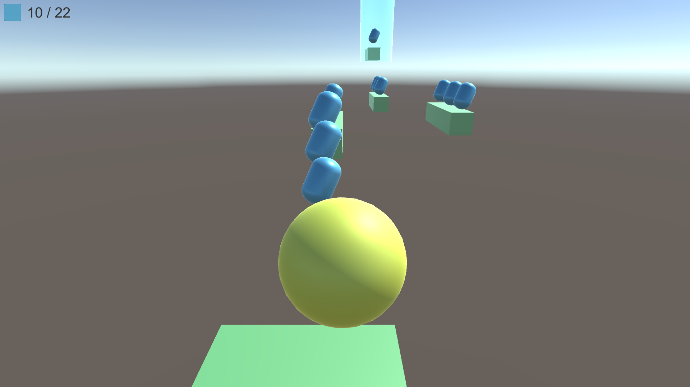

<!-- @format -->

# [Roll The Ball](https://youtu.be/pTc1dakebow?list=PLO-mt5Iu5TeYI4dbYwWP8JqZMC9iuUIW2)

유니티를 연습하기 위해서 만든 공굴리기 게임 입니다.



---

# 목차

- [계획](#계획)
- [Tip](#tip)

---

# 계획

```
1. 게임 이름 : 굴러서 템먹기
2. 장르 : 캐주얼 액션
3. 목표 : 지형을 뛰어넘어 굴러서 템을 먹고 목표 지점에 도달
4. 구성 : 공(Player), 템(Item), 지형(Platform), 결승점(Point)
```

---

# Tip

```
변수를 public으로 선언시 유니티 창에서 편하게 조절 가능

월드 로테이션하고 로컬 로테이션이 따로 있다.

Find 계열 함수는 안쓰는게 최적화에 좋다.

gameObject.SetActive( bool ) :
    오브젝트를 활성화 하거나 비활성화 한다.

```
